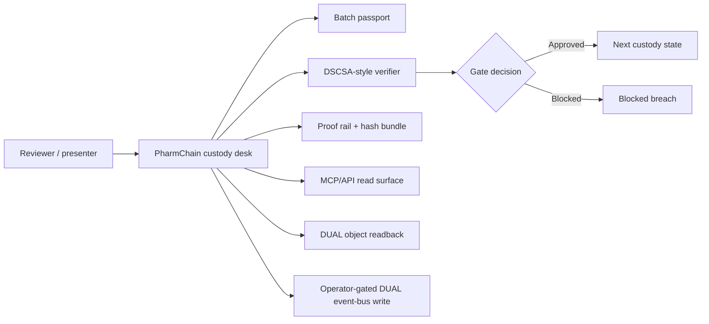

# PharmChain Demo Playbook

Live app: <https://pharmchain-custody-demo.vercel.app/>

This playbook explains the demo as a presenter would run it: what to click, what the audience should notice, and what DUAL is proving at each point. It supports a 5-8 minute walkthrough, a 2-minute compressed pitch, and a follow-up handout for technical reviewers.

## Executive Summary

PharmChain shows a serialized GLP-1 cold-chain batch moving through custody from manufacturer to dispenser. The app evaluates each handoff against DSCSA-style evidence checks before state advances. DUAL supplies the proof/control layer: object readback, lifecycle state, operator-gated write posture, and proof hashes that can be re-derived.

The key message is simple:

> DUAL turns pharma custody from "we recorded a handoff" into "this handoff passed explicit checks, preserved the proof trail, and can be inspected."

The demo is not a production DSCSA compliance system. It stores no patient PII and does not integrate with real manufacturers, wholesalers, pharmacies, dispensers, or regulators.

## Demo Assets

| Asset | Path |
| --- | --- |
| Live app | <https://pharmchain-custody-demo.vercel.app/> |
| Playbook | `docs/pharmchain-demo-playbook.md` |
| Proof run sheet | `docs/pharmchain-proof-run-sheet.md` |
| Reviewer pack | `docs/reviewer-pack.md` |
| Desktop screenshot | `docs/assets/pharmchain-desktop.png` |
| Mobile screenshot | `docs/assets/pharmchain-mobile.png` |

## Demo Thesis

The app shows a pharma custody workflow with three important behaviours:

- A batch passport captures product, lot, serial range, partners, DSCSA flags, and current state.
- A verifier checks whether the next handoff is allowed before state changes.
- A proof rail exposes the evidence hashes and whether production is using DUAL readback.

The demo is intentionally narrow: one synthetic batch, one custody path, no patient data, and no public writes.

## Who This Demo Is For

| Audience | What they should take away |
| --- | --- |
| DUAL product team | DUAL can govern regulated custody state with readback, proof hashes, and gated writes. |
| Developers | DUAL can wrap an existing app through API/MCP surfaces without exposing secrets to the browser. |
| Enterprise / government buyers | A regulated handoff can be checked, blocked, and explained with an inspectable proof trail. |
| Pharma / supply-chain reviewers | The demo models batch-level custody, DSCSA-style evidence, cold-chain checks, and no-PII boundaries. |
| AI-agent builders | Agents can inspect and evaluate custody state through MCP while write actions remain operator-gated. |

## Current State To Say Up Front

The production demo is strong on live DUAL readback, operator-gated event-bus writes, no public writes, no patient PII, deterministic proof hashes, API/MCP read surfaces, and a visible blocked breach path.

Presenter line:

> "This is a custody proof demo. The batch is synthetic, but the control pattern is real: DUAL readback, explicit gates, no public writes, and proof hashes a reviewer can inspect."

## System Map

What this means:

- The batch passport is the human-readable object view.
- The verifier checks the next event before state advances.
- The blocked breach path proves the gate can refuse unsafe evidence.
- The proof rail and `/api/proof` expose the hash set.
- DUAL readback proves the app is not only showing local mock state in production.
- Live writes are available only through an operator-gated server path.

## Recommended Timing

| Segment | Time | Purpose |
| --- | ---: | --- |
| Open and frame | 45 sec | Establish synthetic batch, no PII, no public writes. |
| Batch passport | 60 sec | Show product, lot, serial range, partners, and custody state. |
| Safe gate | 90 sec | Verify the next handoff and show an approved decision. |
| Breach gate | 90 sec | Simulate cold-chain failure and show a blocked decision. |
| Proof | 90 sec | Explain DUAL readback, hashes, and proof re-derivation. |
| MCP/API | 60 sec | Show machine-readable reviewer and agent surfaces. |
| Close | 30 sec | Tie DUAL to regulated custody control. |

Total: roughly 6-7 minutes.

## Two-Minute Version

Use this if the audience already understands DUAL.

1. Open the app and point to `DUAL READBACK READY`, `OPERATOR-GATED WRITES`, `PUBLIC WRITES FALSE`, and `0 PII FIELDS`.
2. Show the batch passport: `PHC-GLP1-2026-0004`, `GLP-1 cold-chain pen`, lot `GLP1-AU-26-042`.
3. Click `Verify next gate`; show `Approved`.
4. Click `Simulate breach`; show `Blocked` with the cold-chain reason.
5. Point to the proof rail: batch hash, custody root, DSCSA hash, event hash, state hash, integrity hash.
6. Close with: "The handoff is useful, but the blocked breach is what proves the gate is active."

## 1. Open The App

Start at the live app. Point out the first-viewport signals:

- `DUAL READBACK READY`
- `OPERATOR-GATED WRITES`
- `PUBLIC WRITES FALSE`
- `0 PII FIELDS`
- DUAL brand and reviewer disclosure

The app is designed as a custody desk, not a generic dashboard. The first viewport shows the batch passport, verifier workflow, proof rail, and reviewer guide without needing a separate script.

Presenter line:

> "The first screen tells us the safety posture before we touch the workflow: live DUAL readback, gated writes, public writes false, and no patient data."

## 2. Explain The Batch Passport

Call out the stable synthetic batch:

- Batch: `PHC-GLP1-2026-0004`
- Product family: `GLP-1 cold-chain pen`
- Lot: `GLP1-AU-26-042`
- Serial range: `AU042-000001..AU042-000480`
- Unit count: `480`
- Manufacturer: `Northstar Biologics`
- Wholesaler: `Harbour Wholesale`
- Pharmacy: `Harbourside Pharmacy`

What this proves:

- DUAL can represent a regulated object, not just a generic token.
- The object carries partner, identity, custody, and proof fields.
- The record stays at batch/custody level and excludes patient PII.

## 3. Verify A Safe Handoff

Click `Verify next gate`.

The expected safe decision is `Approved`.

The verifier checks:

- known lifecycle transition;
- allowed source state;
- valid manufacturer signature;
- authorized trading partners;
- transaction information;
- transaction statement;
- product identifier and serial verification;
- cold-chain range;
- receiver identity;
- patient-PII exclusion.

Presenter line:

> "The state does not move just because the UI asks for it. The next event has to satisfy the custody and DSCSA-style checks first."

## 4. Simulate A Breach

Click `Simulate breach`.

The expected decision is `Blocked`, with a cold-chain reason.

What this proves:

- The verifier is not decorative.
- Unsafe evidence is rejected before state advances.
- A reviewer can see why the gate failed.
- The demo covers both the happy path and the policy boundary.

Presenter line:

> "The blocked path is the proof that this is a gate, not only a receipt generator."

## 5. Show The Proof Rail

Use the right rail or `/api/proof`.

Call out:

- verifier level, such as `dual_readback_rederived`;
- proof source, such as `dual_readback`;
- `publicWrites=false`;
- `liveDualWrites=true` when configured;
- batch id and state;
- next event and next state;
- decision result;
- evidence refs;
- hash set.

Proof interpretation:

| Proof field | Why it matters |
| --- | --- |
| `batch_hash` | Fingerprint of the normalized batch object. |
| `custody_root` | Fingerprint of custody event history. |
| `dscsa_hash` | Fingerprint of DSCSA-style compliance flags. |
| `event_hash` | Fingerprint of the latest or proposed event. |
| `state_hash` | Fingerprint of current lifecycle state. |
| `integrity_hash` | Combined proof for the record. |

Presenter line:

> "This is the trust receipt. The app can show the custody state, the decision, the evidence refs, and the hashes needed to re-derive the proof."

## 6. Show API And MCP Surfaces

Use these routes if the audience wants machine-readable proof:

- `/api/dual/status`
- `/api/batches/current`
- `/api/proof`
- `/api/deployment`
- `/mcp`

For MCP, list tools and emphasize the boundary:

- public: `pharmchain_get_status`, `pharmchain_get_batch`, `pharmchain_evaluate_handoff`, `pharmchain_get_proof`;
- operator-gated: `pharmchain_sync_handoff`, `pharmchain_mint_batch`.

Presenter line:

> "Agents can inspect and evaluate the custody state, but they cannot write to DUAL through the public surface."

## What Not To Over-Claim

- This is not production DSCSA compliance.
- This is not a patient record system.
- This does not connect to real pharma partners or regulators.
- This does not make public DUAL writes available.
- This does not prove production RBAC, retention, uptime, or legal readiness.

## Close

End with:

> The product is not just the custody screen. The product is the governed handoff: explicit state, explicit checks, blocked unsafe evidence, DUAL readback, and proof a reviewer can re-run.
