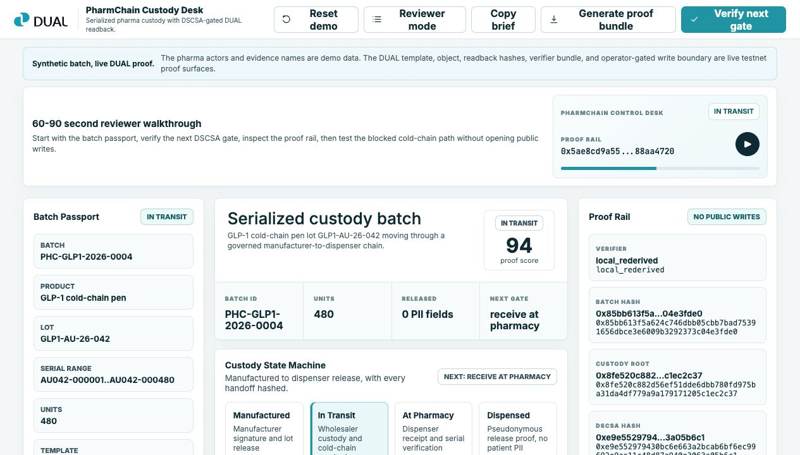
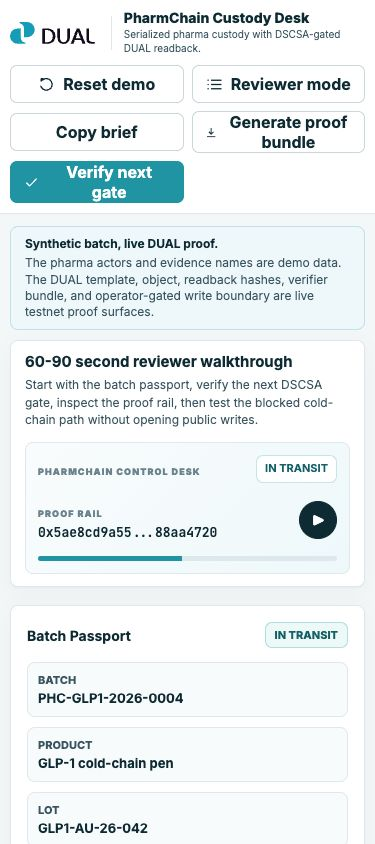

# PharmChain Reviewer Walkthrough

Live app: <https://pharmchain-custody-demo.vercel.app/>

This walkthrough is the short path for a reviewer who wants to inspect the demo without reading the full playbook.

## Visual Check

Desktop:



Mobile:



## 60-Second Path

1. Open the hosted app or local <http://127.0.0.1:4182>.
2. Confirm the first screen says `PharmChain Custody Desk`, shows the DUAL brand, and presents the synthetic-batch/live-proof disclosure.
3. Confirm the top status chips show `DUAL READBACK READY`, `OPERATOR-GATED WRITES`, `PUBLIC WRITES FALSE`, and `0 PII FIELDS` when production is in live DUAL mode.
4. Use `Reviewer mode` or the walkthrough preview to expose the bottom checklist.
5. In `Batch Passport`, confirm batch `PHC-GLP1-2026-0004`, product family `GLP-1 cold-chain pen`, and serial range `AU042-000001..AU042-000480`.
6. In the central batch hero and `Custody State Machine`, confirm the next gate shown by the app.
7. Click `Verify next gate`; the valid next handoff should be `Approved`.
8. Click `Simulate breach`; the decision should switch to `Blocked` with a cold-chain reason.
9. In `Proof Rail`, confirm hash fields are visible and the surface says `No public writes` or `Operator-gated writes`.
10. Open `/mcp`; confirm it lists public read/evaluate/proof tools and operator-gated sync/mint tools.
11. Open `/api/deployment`; confirm `publicWrites=false`, `patientPiiStored=false`, and no secrets are present.

## Two-Minute Presenter Version

Use this when a reviewer asks for the story, not just the checklist.

1. Open with: "This is a synthetic GLP-1 batch moving through custody. DUAL is the proof/control layer, not a patient system."
2. Point to the status chips: DUAL readback, operator-gated writes, public writes false, zero PII.
3. Show the batch passport: manufacturer, wholesaler, pharmacy, lot, serial range, and current state.
4. Click `Verify next gate` and explain that the app checks DSCSA-style requirements before state advances.
5. Click `Simulate breach` and explain that a failed cold-chain window is blocked before writing.
6. Show the proof rail and name the hashes: batch, custody, DSCSA, event, state, integrity.
7. Open `/api/proof` or `/api/deployment` if the reviewer wants machine-readable evidence.

Close with:

> DUAL makes the custody state inspectable. The verifier shows what changed, why it was allowed or blocked, and whether the proof came from live readback.

## What Good Looks Like

- The UI reads as a pharma custody desk, not a generic dashboard.
- The first viewport gives a reviewer enough guidance to demo the product without a separate script.
- The proof rail makes object state and evidence hashes inspectable.
- Invalid cold-chain evidence is blocked with a human-readable reason.
- The API/MCP surface is reviewer- and agent-readable.
- Live writes are operator-gated, not public.
- No patient PII is stored or displayed.

## Machine Checks

Use these if the reviewer wants proof beyond the UI.

```bash
curl -s https://pharmchain-custody-demo.vercel.app/api/dual/status
curl -s https://pharmchain-custody-demo.vercel.app/api/batches/current
curl -s https://pharmchain-custody-demo.vercel.app/api/proof
curl -s https://pharmchain-custody-demo.vercel.app/api/deployment
```

Local validation:

```bash
npm run check
npm run proof:mcp
DEMO_BASE_URL=http://127.0.0.1:4182 npm run smoke
DEMO_BASE_URL=http://127.0.0.1:4182 npm run proof:rederive
```

Production validation:

```bash
DEMO_BASE_URL=https://pharmchain-custody-demo.vercel.app SMOKE_STRICT_NETWORK=1 npm run smoke
DEMO_BASE_URL=https://pharmchain-custody-demo.vercel.app SMOKE_STRICT_NETWORK=1 npm run proof:rederive
```

## Known Scope Boundary

This is a hosted reviewer demo. It is not a production DSCSA compliance system, does not store patient PII, and does not integrate with real manufacturers, wholesalers, pharmacies, dispensers, or regulators.
